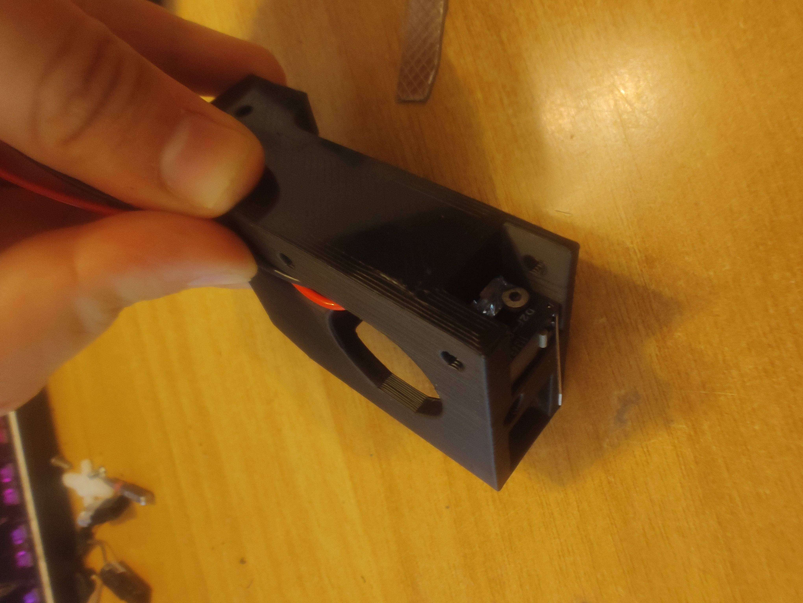
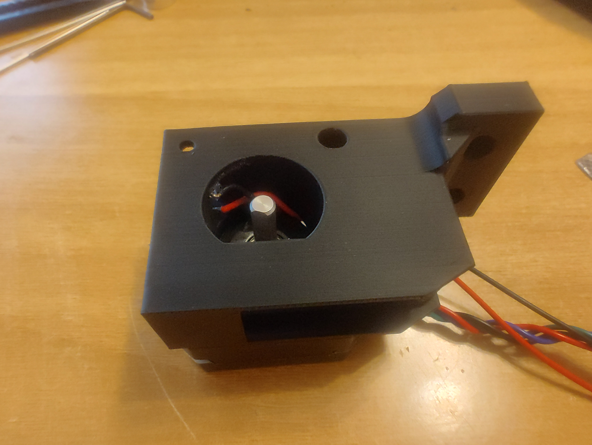
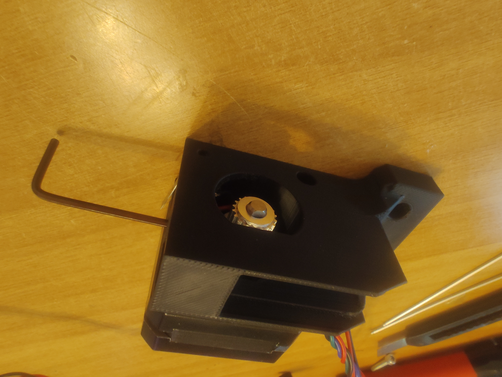
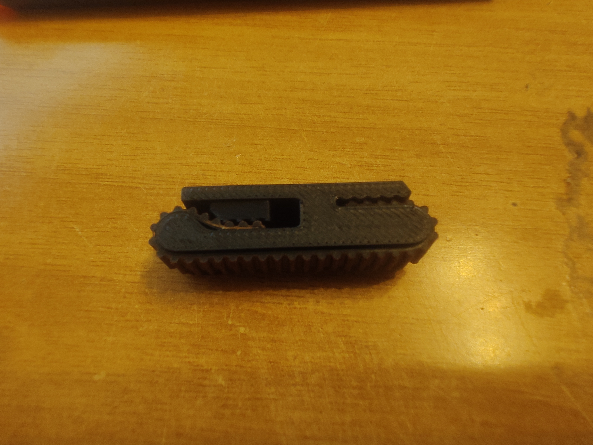
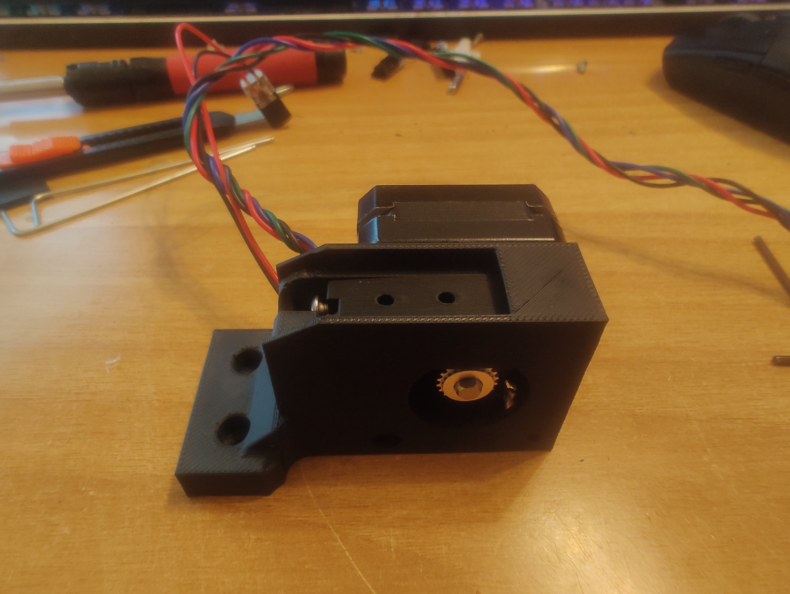
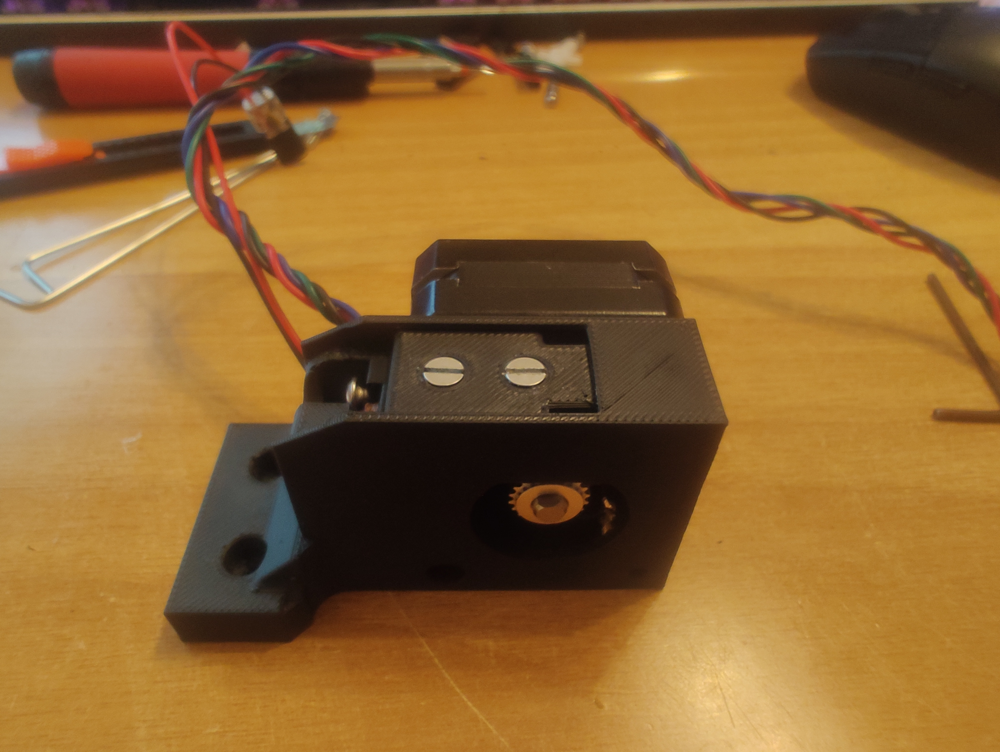
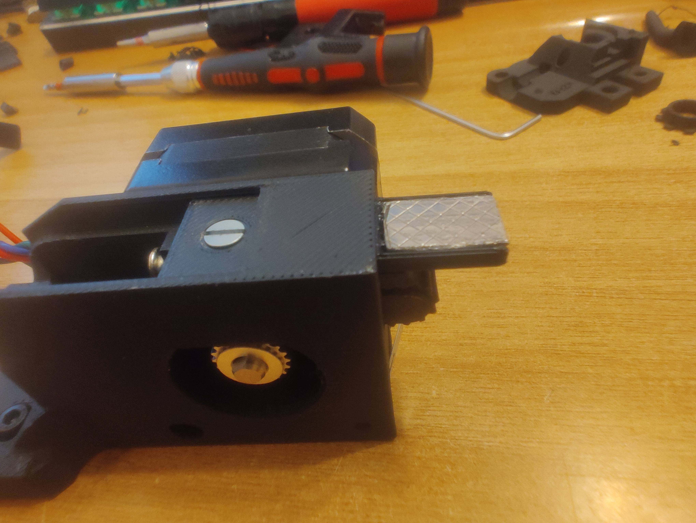

This model uses a small GT2 belt as a toothed rack to move the blobifier's tray back and forth. 
To make room for a stepper motor, the blobifier assembly is risen by 2mm. This should not be an issue on most setups, but depending how your bottom panel sits, it might collide with the shaker arm. To solve this, a redesigned shaker arm is provided.


# BOM

To build this, you will need to have the standard components for a blobifier and a few more:

 * 2x M3 FHCS 6mm
 * 3x M3 BHCS or SHCS 8mm
 * Nema17 Stepper motor, pancake recommended
 * GT2 Timing belt, 37 teeth, open
 * GT2 20T Pulley with 5mm bore
 * An open stepper slot on your motherboard with your preferred driver

If you do not have the required components for a regular blobifier, to build a minimal setup (tray and bucket) you will also need:

 * 2x M3 T-nut
 * 3x M3 SHCS or BHCS 8mm
 * 3x M3 FHCS 8mm (or 6mm also works)
 * 3x M3 heat set inserts
 * 1x 10x15 aluminium strip (if you have the 'newer' 10x30, you can cut it easily)
 * 2x M2 10mm screws (any head)
 * 1x D2F-L microswitch


# Printed parts

You will need to print the following parts:
 * StepperHousing - This is the main blobifier body. It replaces both the base and the mount from the original project. 
 * Tray - the model is designed around the 10x15 old version. The tray has been modified to bolt down to the movement system using two flush screws.
 * BeltCarrier and Tensioner - we wrap the belt around this part. It translates rotational movement to linear. A screw hole allows the belt to be tensioned after installation. 
 * Arm - a taller (by 2mm) shaker arm is provided to avoid collisions.


# Assembly

| Install the D2F-L Switch using two M2x10 screws. | Install the stepper using two M3x8 screws. | Slide in the pulley and tighten the grub screws using the lateral hole. |
| --- | --- | --- |
|  |  |  |

| Place the tensioner in the belt carrier and insert the belt in the tensioner side. Pull the end (so that the tensioner sits at the beginning of the track) and insert tightly on the other side. Screw a M3x8 in the provided hole in the carrier to ensure belt tension. | Place the carrier assembly inside the main part | Insert the tray and screw it in the carrier using two M3x6 FHCS | 
| --- | --- | --- |
|  |  |  |

### Final result



# Software configuration

```ini
# MOTOR6 port on BTT Octopus v1.0
[manual_stepper stepper_blobifier]
step_pin: PE2
dir_pin: PE3
enable_pin: !PD4
microsteps: 32
endstop_pin: tmc2209_stepper_blobifier:virtual_endstop
position_min: 0
position_max: 15
velocity: 100
accel: 2000

[tmc2209 stepper_x]
uart_pin: PE1
interpolate: True
run_current: 0.8
hold_current: 0.3
sense_resistor: 0.110
stealthchop_threshold: 0
driver_SGTHRS: 0
diag_pin: PG14 # Also connect J22 on motherboard, will disable STOP6/J32


```

